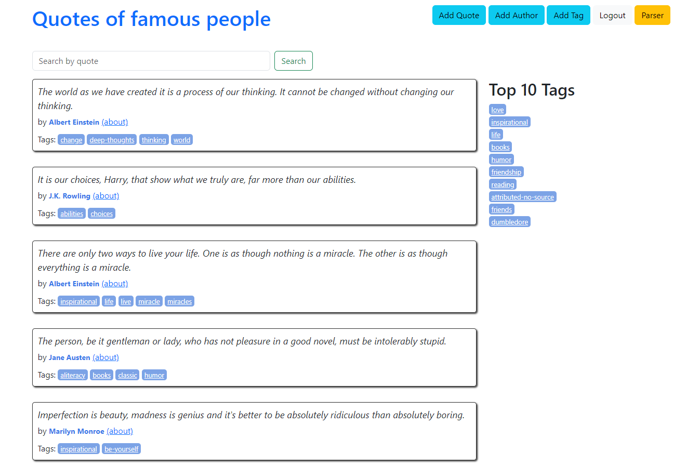

# People Quotes
Django website

<a href="https://quotes-to-scrape.fly.dev/">Visit People Quotes</a>

<h3>So this is People Quotes and here you can:</h3>
<ul>
  <li>Sign in and Reset Password</li>
  <li>Filter quotes by different tags</li>
  <li>Search for a quote by its text</li>
   <li>Open author page</li>
  <li>Add Quote, Tag and Author</li>
  <li>Parse all quotes to csv to your devise</li>

</ul>  

  
  
  

I used the next technologies and packages
<ul>
  <li>Python</li>
  <li>Django</li>
  <li>HTML/CSS</li>
  <li>Bootstrap</li>
  <li>BeautifulSoup4</li>
  <li>MongoDB</li>
  <li>Postgres</li>
  <li>SQLAlchemy</li>
  <li>Alembic</li>
  <li>Docker</li>
</ul>  

